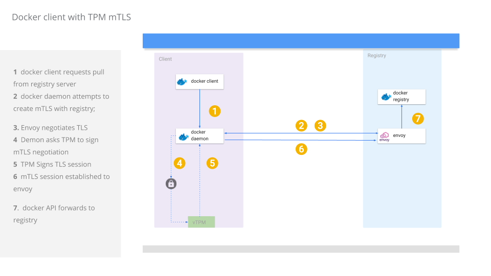

# Docker daemon mTLS with Trusted Platform Module

Fork of docker upstream that uses a client certificate sealed into a [Trusted Platform Module (TPM)](https://en.wikipedia.org/wiki/Trusted_Platform_Module) for mTLS connections to a private docker registry.

One usecase for doing this would be to ensure only attested docker clients can connect to and pull an image from your registry.  The docker registry owner can distribute a client certificate only after [remote attestation](https://tpm2-software.github.io/tpm2-tss/getting-started/2019/12/18/Remote-Attestation.html) of a candidate client's VM.  Remote attestation can help ensure the integrity of the docker client's whole VM and that it has not been tampered with.

Once attestation is done, the docker registry owner can seal a client certificate such that ONLY that specific VM and TPM can decrypt seal the key to its TPM.  After the key is sealed by the docker client VM, the RSA key itself cannot leave that VM but can be asked by the docker client to sign some data.   The data the docker client asks the TPM to sign is a part of the TLS session it could initiate with an upstream docker registy.

In this way, you can distribute mTLS client certificates securely to only those docker clients that are trusted.  The distinction between using a TPM and regular distribution of the client certificates as documented [here](https://docs.docker.com/engine/security/certificates/) is that the client key can get compromised and redistributed.

With a TPM, the key during transit cannot be decrypted anywhere else other than on that specific TPM it was intended for.  Once embedded to that TPM, the key cannot be reexported

>>> NOTE:  this tutorial is **NOT** supported by Google and I do not recommend using in its current for beyond amusement. 


The following tutorial will use the TPM capabilities on a Google Cloud [Shielded VM](https://cloud.google.com/security/shielded-cloud/shielded-vm) which will run the docker client with embedded keys.  Another VM will run a docker registry server which will only accept mTLS connections signed by its CA.




### Create VMs

First create the two VMs:

```bash
gcloud beta compute  instances create docker-client \
  --zone=us-central1-a --no-service-account --no-scopes  \
  --image=ubuntu-1804-bionic-v20200317 --image-project=gce-uefi-images \
  --no-shielded-secure-boot --shielded-vtpm --shielded-integrity-monitoring 

gcloud beta compute  instances create docker-registry --tags registry \
 --no-service-account --no-scopes --image=ubuntu-1604-xenial-v20200407 --image-project=ubuntu-os-cloud 
```

Acquire the IP address for the machines and open firewall

```bash
export REGISTRY_IP=`gcloud compute instances describe docker-registry --format="value(networkInterfaces[0].accessConfigs.natIP)"`
echo $REGISTRY_IP

export CLIENT_IP=`gcloud compute instances describe docker-client --format="value(networkInterfaces[0].accessConfigs.natIP)"`
echo $CLIENT_IP

gcloud compute firewall-rules create allow-registry-https --allow=tcp:443 --source-ranges=$CLIENT_IP/32  --target-tags registry
```

#### Install Docker on docker-client, docker-registry

- [Install Docker](https://docs.docker.com/engine/install/ubuntu/)

#### Install golang on docker-client

- [Install golang](https://golang.org/dl/)

#### Install Envoy on docker-registry

- [Install Docker Registry](https://www.getenvoy.io/install/envoy/ubuntu/)

#### Configure docker-client /etc/hosts

Add to /etc/hosts on docker-client:

```bash
$REGISTRY_IP server.domain.com
```

### Start Registry

Copy envoy configuration files and ssh to the registry

```bash
gcloud compute scp envoy/envoy.yaml docker-registry:
gcloud compute ssh docker-registry

sudo docker run  -p 5000:5000   registry:2
```

### Start Envoy

SSH to the VM again from a new window and start envoy

```bash
sudo envoy -c envoy.yaml
```

We are running envoy as an HTTP/REST proxy for registry operation and to handle mTLS


### Embed Client Certificate to TPM

The following step will use `go-tpm` library to seal a private key into the TPM.  Once its embedded, you can delete the key from the VM.

The steps below are usually automated after remote attestation is done.  For more information on remote attestation and securely transferring an RSA key to the TPM, see the references section

```bash
# following  importExternalRSA.go just takes the private key in pem format and embeds loads it as an external key into the TPM
# the output is just a reference context handle to the TPM's version of the key
wget https://raw.githubusercontent.com/salrashid123/tpm2/master/utils/importExternalRSA.go
gcloud compute scp importExternalRSA.go docker-client:


gcloud compute scp certs/ca.crt docker-client:
gcloud compute scp certs/client.key docker-client:
gcloud compute scp certs/client.cert docker-client:
```

SSH to the docker client and embed the key

```
gcloud compute ssh docker-client
go mod init main
sudo /usr/local/go/bin/go run importExternalRSA.go  --pemFile client.key -primaryFileName primary.bin -keyFileName client.bin
```

Sample output will show the RSA key and the handle to the sealed key `client.bin`
   ```bash
   2020/04/10 21:44:30 ======= Init ========
   2020/04/10 21:44:30 ======= Flushing Transient Handles ========
   2020/04/10 21:44:30     0 handles flushed
   2020/04/10 21:44:30     Primary KeySize 256
   2020/04/10 21:44:30      tpmPub Size(): 256
   2020/04/10 21:44:30      Pub Name: 000b8bcbb855a73c73710bb7682ed85d1812d6345d7f909ba9c6f4793905a01ff2c2
   2020/04/10 21:44:30      PubPEM: 
   -----BEGIN PUBLIC KEY-----
   MIIBIjANBgkqhkiG9w0BAQEFAAOCAQ8AMIIBCgKCAQEAuaeVJmtAdFv9NakWGzLR
   P4bR6xZT3IQAsKQvpVGgGP9/FUc46VK1BI3WpqKCfBFXNDfn8TQlOZizH+gro20n
   u/vSkCzbB7M9xyuUVWpg9EmRaY5TGxNHsYvGNXVYEQ6bIE9EU19CeLgEeqBOlCJc
   bzLEgGqTidSZdrJmoSkXYyUvHdPCDQlEu4U0LKC8+HW0wDD10TGZVNboA90bphcg
   boUiF5scU4V3C48maxGEGKg3VtL+R4IoyPaxNsorPwZtOZPM8gtQSk2ObMFtXHCr
   La0hgZWT4t315Ot+aNo8xL2qzqj2fTDjxI1iSEXIeVGQjsogz3OeOqI2zGh+ClYj
   qwIDAQAB
   -----END PUBLIC KEY-----
   2020/04/10 21:44:30      ContextSave (primary.bin) ========
   2020/04/10 21:44:30      ContextLoad (primary.bin) ========
   2020/04/10 21:44:30 ======= Import ======= 
   2020/04/10 21:44:30      Imported Public digestValue: 1d1f711ab933d9a7162b5df262e228d6c0e90e2d3c3a82d87f5309004594d394
   2020/04/10 21:44:30      Loaded Import Blob transient handle [0x80000001], Name: 000b1d1f711ab933d9a7162b5df262e228d6c0e90e2d3c3a82d87f5309004594d394
   2020/04/10 21:44:30      ContextSave (client.bin) ========
   2020/04/10 21:44:30      ContextLoad (client.bin) ========
   2020/04/10 21:44:30 Signature data:  qBFfEqrtIC1ET7EN8qjcdFi09UuPHZZ6b4UDy6R8/cyuPs3XmgNk0mdBFaPHJbHccG5POnBmxy77xx/V3d2CX+pa1EjZjCEC0R+kQBinO8XGoUZASGgwYaNegXAWkhdauTuR4AVJnb0fEicqaghVhcZKJPajaBZnA5HNo2gvZIYgxyDD1E1NDUGlgCsuV++5rYg9Do/y3vEeq17B49nfD8RlLMuoydj4Lf8mwKCfpDvz2eITxoYquNxbh7zddQCXJOud3TvoMMsghESBcpWW5gyy28A/PZrsCDM/dY8mZKz1axpnKwoJBwnOcavKRgM8R0nFEVpSMvYPXl7kMS6mTQ
   ```


```bash
$ tree
.
├── ca.crt
├── client.bin       <<<<<<<<<< TPM key handle for client.key
├── client.cert
├── client.key
└── primary.bin
```

Delete client.key (we don't need this at all)


### Configure docker daemon to use certs

Copy the files for the certificates to the folder where docker daemon looks for them.

```bash
sudo mkdir -p /etc/docker/certs.d/server.domain.com/
sudo cp ca.crt /etc/docker/certs.d/server.domain.com/
sudo cp client.cert /etc/docker/certs.d/server.domain.com/
sudo cp client.bin /etc/docker/certs.d/server.domain.com/
```


Note Docker daemon looks for specific file extensions in the folder that defines the upstream registry.

The modification this repo makes to docker's registry code looks for a specific file extension `.bin` as as being a TPM Handle and not regular private key.

If it sees `client.bin`, it will use a go-tpm `crypto.Signer` library i wrote that will perform the mTLS operations:

 - [TPM Signer implementations](https://github.com/salrashid123/signer)


#### Clone moby

Now on your laptop

```bash
git clone https://github.com/moby/moby.git
cd moby
git checkout 9c71a2be319371d9ed9ab4429f2f4ddfee732e70
```

#### Copy vendoring and modified registry and tpm signer

I modified two files for this:  docker's `registry.go` and my own implementation of TPM Signer to help with concurrent access (TOOD: fix this in my library...i just open/close on every call which is not efficient!!!)


```bash
cp ../diff/vendor.conf vendor.conf

mkdir -p vendor/github.com/salrashid123/signer
git clone https://github.com/salrashid123/signer.git vendor/github.com/salrashid123/signer
cp ../diff/tpm.go  vendor/github.com/salrashid123/signer/tpm/tpm.go

mkdir -p /tmp/moby/vendor/github.com/google/go-tpm/
git clone https://github.com/google/go-tpm.git vendor/github.com/google/go-tpm

cp ../diff/registry.go registry/registry.go
```

#### Build

Build the docker daemon

```
cd moby/
make
```

#### Copy dockerd to docker client

```
gcloud compute scp ./bundles/binary-daemon/dockerd docker-client: 
```

#### Start custom dockerd

On the docker-client VM, stop the out of the box docker daemon and run your own:

```bash
$ sudo service docker stop
$ sudo `pwd`/dockerd 
```


### Pull tag and push an image to custom registry

In a new window on docker-client pull and image, retag it and try to push it to the registry that requires mTLS:

```bash
sudo docker pull alpine
sudo docker tag alpine server.domain.com/alpine
sudo docker push server.domain.com/alpine
```

The sample output you will see will call the custom handler in registry.go which will return a custom TLConfig object:

```golang
			caName := "ca.crt"
			caData, err := ioutil.ReadFile(filepath.Join(directory, caName))
			if err != nil {
				return err
			}

			caCertPool := x509.NewCertPool()
			caCertPool.AppendCertsFromPEM(caData)

			clientCaCertPool := x509.NewCertPool()
			clientCaCertPool.AppendCertsFromPEM(caData)
			logrus.Printf(">>>>>>>>>>>>>>>>>>>>>>>>>>>  USING TPM  <<<<<<<<<<<<<<<<<<<<<<<<<<<<<<<")

			r, err := saltpm.NewTPMCrypto(&saltpm.TPM{
				TpmDevice: "/dev/tpm0",
				//TpmHandle: 0x81010002,
				TpmHandleFile:  filepath.Join(directory, f.Name()),
				PublicCertFile: filepath.Join(directory, certName),
				ExtTLSConfig: &tls.Config{
					RootCAs: caCertPool,
				},
			})

			if err != nil {
				return fmt.Errorf("Unable to initialize TPM Certificate client certificate %v", err)
			}
			tlsConfig = r.TLSConfig()

```

Sample output of docker daemon will be:
```bash
$ sudo `pwd`/dockerd
INFO[2020-04-10T21:54:58.620676182Z] Starting up                                  
INFO[2020-04-10T21:54:58.622597772Z] detected 127.0.0.53 nameserver, assuming systemd-resolved, so using resolv.conf: /run/systemd/resolve/resolv.conf 
INFO[2020-04-10T21:54:58.623438209Z] parsed scheme: "unix"                         module=grpc
INFO[2020-04-10T21:54:58.623547435Z] scheme "unix" not registered, fallback to default scheme  module=grpc
INFO[2020-04-10T21:54:58.623617220Z] ccResolverWrapper: sending update to cc: {[{unix:///run/containerd/containerd.sock  <nil> 0 <nil>}] <nil> <nil>}  module=grpc
INFO[2020-04-10T21:54:58.623670659Z] ClientConn switching balancer to "pick_first"  module=grpc
INFO[2020-04-10T21:54:58.626410134Z] parsed scheme: "unix"                         module=grpc
INFO[2020-04-10T21:54:58.626509872Z] scheme "unix" not registered, fallback to default scheme  module=grpc
INFO[2020-04-10T21:54:58.626578070Z] ccResolverWrapper: sending update to cc: {[{unix:///run/containerd/containerd.sock  <nil> 0 <nil>}] <nil> <nil>}  module=grpc
INFO[2020-04-10T21:54:58.626630108Z] ClientConn switching balancer to "pick_first"  module=grpc
INFO[2020-04-10T21:54:59.668677192Z] [graphdriver] using prior storage driver: overlay2 
WARN[2020-04-10T21:54:59.673409680Z] Your kernel does not support swap memory limit 
WARN[2020-04-10T21:54:59.673445054Z] Your kernel does not support cgroup rt period 
WARN[2020-04-10T21:54:59.673450670Z] Your kernel does not support cgroup rt runtime 
WARN[2020-04-10T21:54:59.673455240Z] Your kernel does not support cgroup blkio weight 
WARN[2020-04-10T21:54:59.673459763Z] Your kernel does not support cgroup blkio weight_device 
INFO[2020-04-10T21:54:59.673646451Z] Loading containers: start.                   
INFO[2020-04-10T21:54:59.756976150Z] Default bridge (docker0) is assigned with an IP address 172.17.0.0/16. Daemon option --bip can be used to set a preferred IP address 
INFO[2020-04-10T21:54:59.794527355Z] Loading containers: done.                    
INFO[2020-04-10T21:54:59.817035846Z] Docker daemon                                 commit=9c71a2be31 graphdriver(s)=overlay2 version=dev
INFO[2020-04-10T21:54:59.824902528Z] Daemon has completed initialization          
INFO[2020-04-10T21:54:59.843143619Z] API listen on /var/run/docker.sock           
INFO[2020-04-10T21:55:18.314699785Z] Loading TPM key: /etc/docker/certs.d/server.domain.com/client.bin 
INFO[2020-04-10T21:55:18.315041587Z] >>>>>>>>>>>>>>>>>>>>>>>>>>>  USING TPM  <<<<<<<<<<<<<<<<<<<<<<<<<<<<<<< 

```

## Conclusion

Well, this is just a hack and POC i wanted to try out.  I'll file and issue/FR w/ moby to see if this is something worth formally in upstream


### References
 - [TPM Remote Attestation](https://github.com/salrashid123/tpm2/tree/master/tpm_make_activate)
 - [TPM Secure Transfer of RSA Key](https://github.com/salrashid123/tpm2/tree/master/ek_import_rsa_blob)
 - [go-tpm Samples](https://github.com/salrashid123/tpm2)
 - [TPM Signer implementations](https://github.com/salrashid123/signer)

